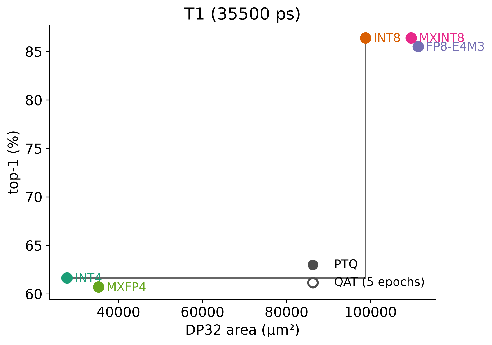

# FormatScope

[](https://github.com/SiHeonOh/FormatScope/actions/workflows/ci.yml)

Choosing a number format for an AI accelerator trades model accuracy against silicon cost, and today only the accuracy half is reproducible. FormatScope measures both halves on the same model with open tools: a ResNet-8 on CIFAR-10 quantized to INT4, INT8, FP8-E4M3, MXINT8, and MXFP4, and one bit-exact 32-lane dot-product unit (DP32) per format synthesized to the SkyWater 130 nm cell library and timed with OpenSTA. A command-line tool, `formatscope`, joins the two, plots accuracy against area at a shared clock, and recommends the smallest unit inside an accuracy margin or the most accurate unit under an area budget.



*Top-1 accuracy after post-training quantization against DP32 cell area with every unit meeting the same 36.6 ns clock. The step line is the Pareto front. Filled markers are PTQ; hollow markers will be the 5-epoch fine-tune when it lands.*

## Reproduce in six commands

```bash
make env          # Python venv with torch, cocotb, pytest
make train        # FP32 ResNet-8 baseline, 60 epochs (~15 min on one GPU)
make quant        # post-training quantization, all six configurations -> results/accuracy.csv
make test         # exhaustive decoder tests + 10,000-vector DP32 tests on Icarus
make synth sta    # Yosys + ABC on sky130 HD, then OpenSTA -> results/area.csv, results/timing.csv
make plot         # results/figures/
```

The EDA tools are pinned in `versions.lock` (OSS CAD Suite 2026-09-09, OpenSTA 3.1.0, sky130 `1689ac3f`); `scripts/setup_lane_s_wsl.sh` installs them on Ubuntu or WSL2 and `scripts/setup_lane_s_mac.sh` on Apple Silicon, and each ends with the two smoke tests. `synth/libs.toml` names the liberty file per machine. Every number below regenerates from these targets.

## Results

sky130 HD, typical corner, pre-layout. `unc` is each unit's fastest mapping; `T1` is the shared clock of 36.6 ns that every unit meets (decision D7). Alignment window 24 (D6).

| format | bits per number | PTQ top-1 | QAT top-1 | area unc (µm²) | area T1 (µm²) | delay unc (ps) | delay T1 (ps) |
|---|---|---|---|---|---|---|---|
| fp32 | 32 | 86.34 | — | — | — | — | — |
| int4 | 4 | 61.65 | — | 27,906 | 27,772 | 8,907 | 9,722 |
| int8 | 8 | 86.39 | — | 100,177 | 98,811 | 10,719 | 12,197 |
| fp8e4m3 | 8 | 85.50 | — | 111,259 | 111,272 | 35,040 | 36,100 |
| mxint8 | 8.25 | 86.39 | — | 110,692 | 109,630 | 31,478 | 35,952 |
| mxfp4 | 4.25 | 60.71 | — | 35,967 | 35,294 | 26,451 | 31,201 |
| int4_b32 | 4.25 | 78.46 | — | — | — | — | — |

"Bits per number" amortizes the 8-bit shared scale of the block-32 formats over the block. `int4_b32` (INT4 elements with a block-32 power-of-two scale) separates how much of MXFP4's behaviour comes from block scaling and how much from the E2M1 encoding. It has a verified unit too (`rtl/int4_b32/`, the MXINT8 design at 4 bits, decision A1); its area and timing rows come from `make synth sta FMT=int4_b32` and are not in this table yet.

Verification: every unit passes 10,000 seeded random vectors plus directed corners against a NumPy reference (`make test`); every decoder is tested over all of its codes; and one real layer's dot products pushed through the PyTorch path and the hardware reference agree bit-exactly for the INT and MX formats (`results/fidelity.csv`). CI runs the decoders and a 300-vector subset on every push.

## Findings

**H1 — a fused FP8 dot product costs far less than a single FP8 MAC suggests.** At the shared clock, the FP8-E4M3 DP32 is **12.6% larger than INT8** (111,272 vs 98,811 µm²). The single-MAC estimate in van Baalen et al. is 50–180%. The difference is the fused stage: the 32 products and the accumulator are aligned once, summed in one integer tree, and normalized and rounded once, so the per-lane cost is a 4×4-bit significand multiplier plus a shifter rather than a full floating-point adder. Where the remaining cost sits, from the hierarchical synthesis (`results/breakdown.csv`, `results/figures/breakdown.png`): in INT8 the 32 multipliers are 77% of the unit (76,637 µm²) and the tree 16%. In FP8 the multipliers shrink to 17,991 µm² and the **alignment stage becomes 54% of the unit (59,739 µm²)**, with the wider tree at 28,900 and the decoders, normalize, and accumulate together under 10k. The FP8 penalty is alignment, not multiplication. MXINT8 keeps INT8's multipliers and tree within 10% and pays its increment in the two-term align (6,819) and normalize (3,526) stages; MXFP4 does the same over INT4.

**H2 — block scaling is the cheap lever, on the hardware side.** MXINT8 costs **+11.0%** over INT8 and matches its accuracy exactly (86.39%); MXFP4 costs **+27.1%** over INT4 for 0.25 more bits per number. The accuracy side of H2 is open: after PTQ, MXFP4 (60.71%) sits *below* plain INT4 (61.65%) while INT4 with block scales reaches 78.46%, which points at the E2M1 element encoding rather than the block scale. The five-epoch fine-tune that the hypothesis is stated for is not in this table yet.

**Alignment window.** Widening the fused stage's window from 24 to 32 bits costs FP8 +17% area (129,825 vs 111,272 µm² at T1) for no delay gain; MXINT8 and MXFP4 move under 4%. 24 is the default.

**H3 — the ASAP7 rerun** has not been run; the flow targets a second library through `synth/libs.toml`, but no ASAP7 numbers exist in this repository.

**Spread.** Each unit is also synthesized five times at T1 with ABC's delay target perturbed by −2, −1, 0, +1 and +2% (D8); the table reports the median. INT4, INT8, and MXFP4 return the identical netlist every time — T1 does not bind them — and MXINT8 moves 0.04%. FP8 spans 109,927 to 114,806 µm² (4.4%), larger at tighter targets, so its increment over INT8 is 11% to 16% across the runs. The ranking INT8 < MXINT8 < FP8 holds in every run, though FP8's loosest mapping comes within 0.3% of MXINT8.

## The hardware

One dot-product unit per format, five in all, under `rtl/`. Each takes 32 pairs of codes and a running total, and produces the new running total one clock later. The five share one port list, so the synthesis, timing, and test scripts are the same for every unit:

```verilog
module dp32_<fmt> #(parameter ALIGN_W = 24) (
  input  wire         clk, rst_n, en, clear,   // synchronous reset; clear wins over en
  input  wire [255:0] a_flat, b_flat,          // 32 codes each (128 bits for the 4-bit formats)
  input  wire [7:0]   scale_a, scale_b,        // E8M0 block scales; MX units only
  output reg  [31:0]  acc_out,                 // INT32 (INT units) or FP32 format (FP8 and MX)
  output reg          flag_nan                 // sticky: a NaN code or a 0xFF scale was seen
);
```

Every unit is the same shape: a combinational multiply stage, an adder tree, and a normalize-and-accumulate stage feeding a single 32-bit register. The stages are separate named modules (`mul_stage_*`, `tree_stage_*`, `align_stage_*`, `normacc_stage_*`) so the hierarchical synthesis run can charge area to each one; that is where the breakdown figure comes from.

- **INT8 and INT4** (`rtl/int8/`, `rtl/int4/`, `rtl/common/adder_tree.v`): 32 signed products, a balanced five-level tree that grows one sign bit per level (21 bits for INT8, 13 for INT4), and an INT32 accumulator. INT4 is INT8 with `W = 4`; the tree is written once with parameters. Overflow wraps in two's complement (D13). ResNet-8 never reaches it; the test does, by 4,098 accumulations of 32 × (−128)².
- **FP8-E4M3** (`rtl/fp8e4m3/`, `rtl/common/fused_stage.v`): each lane decodes both codes (`decode_fp8e4m3.v`), multiplies the two 4-bit significands, and adds the exponents. The 32 products and the FP32 accumulator then go through the **fused stage** once: find the maximum exponent, shift every term into a common `ALIGN_W`-bit window with guard, round, and sticky bits, negate the negative ones, sum all 33 in one integer tree, take the magnitude, count leading zeros, normalize, and round **once**, to nearest even, into the FP32 register. Nothing in the datapath is an FP32 adder. A NaN input zeroes that lane and sets `flag_nan` (D3). Every bit width and the range argument for why the register needs no subnormals or infinities are in [`docs/fused-stage.md`](docs/fused-stage.md).
- **MXINT8 and MXFP4** (`rtl/mxint8/`, `rtl/mxfp4/`): the INT8 multiply and tree stages (or an E2M1 decode and a 4×4 magnitude multiply for MXFP4) produce the exact integer block sum. That sum is normalized to its leading one, given the block exponent `scale_a + scale_b − OFFSET`, and enters the same fused stage as a single term next to the accumulator. A 0xFF scale zeroes the block and sets `flag_nan` (D4). Extreme scales that leave FP32's range saturate to the largest finite value or return +0; real model scales never get near that.

**Verification** (`tb/`, cocotb 2.0 on Icarus Verilog, Verilog-2005). The NumPy reference in `tb/refs.py` was written before the RTL, step for step from the fused-stage document with explicit integer shifts, so any mismatch is a bug in one of them and never a matter of interpretation. `tb/test_refs.py` then checks the reference itself against exact rational arithmetic: when no bit is dropped in alignment the result is the correctly rounded sum, and when bits are dropped the error stays inside the documented bound. On top of that reference:

- the three decoders are tested over every code (256 FP8, 16 E2M1, 256 E8M0);
- every unit runs 10,000 seeded random vectors with the accumulator checked on **every cycle**, with `en` gaps and `clear` pulses mixed into the stream so the prior total is built by the unit itself, not preloaded (D14);
- directed corners cover the extremes, alternating signs, element pairing (a one-hot lane must meet its partner at the same index), exact cancellation, subnormal-heavy inputs, terms of very different magnitude, each rounding decision (guard, round, sticky, tie to even, carry out of the significand), NaN lanes and scales, saturation and underflow, and control priority. Each constructed corner first asserts in Python that the reference takes the path the corner is named after, so a corner cannot silently stop testing what its name says;
- the FP8 and MX units run all of this at both window widths, 24 and 32.

`make test` runs the full suite in about three minutes; CI runs the decoders and a 300-vector subset of each unit on every push (D15). Waveforms are off by default and switched on with `FORMATSCOPE_VCD=1`.

## Limitations

- Pre-layout, cell-level area and delay: no placement, no routing, no wires. Absolute sky130 numbers do not transfer to other nodes; the ratios between formats are the claim.
- ABC's constraint-driven mapping is deterministic here (repeated runs agree to the last digit) and it maps to its own timing model, which reads about 1.5% faster than OpenSTA on the same netlist. Units are therefore mapped 3% inside T1 (`abc_margin` in `synth/targets.toml`) and OpenSTA's number is the one reported.
- There is no second, tighter clock. The INT units are about three times faster than the fused units at their fastest mapping, so no period tighter than T1 constrains both groups; ABC can trade slack for area but cannot map a unit faster than its delay-optimal result.
- Activations use one scale per tensor and weights one scale per output channel, calibrated on 512 training images (D10, D11). The per-channel requantization after the accumulator is excluded from every unit alike.
- Fake quantization accumulates in FP32; the fused FP8 and MX hardware rounds once per 32 products. Measured on one real layer (`quant/fidelity.py`, `results/fidelity.csv`): INT4, INT8, MXINT8, and MXFP4 are bit-exact between the two paths; FP8-E4M3 differs by at most 1.1e-7 absolute (6.4e-8 relative) over 300 outputs, so the accuracy table stands for the hardware.
- Power and energy are out of scope.

## Decisions and references

Every design choice the numbers rest on is listed with its evidence in [`docs/decisions.md`](docs/decisions.md); the fused stage's bit widths are derived in [`docs/fused-stage.md`](docs/fused-stage.md); sources are in [`docs/references.md`](docs/references.md). The plan the project was built to is [`docs/build-plan.md`](docs/build-plan.md).

Si Heon Oh (RTL and verification), Seungmin Nam (quantization and training), Rakshita Gupta (synthesis, timing, the tool). MIT license.
